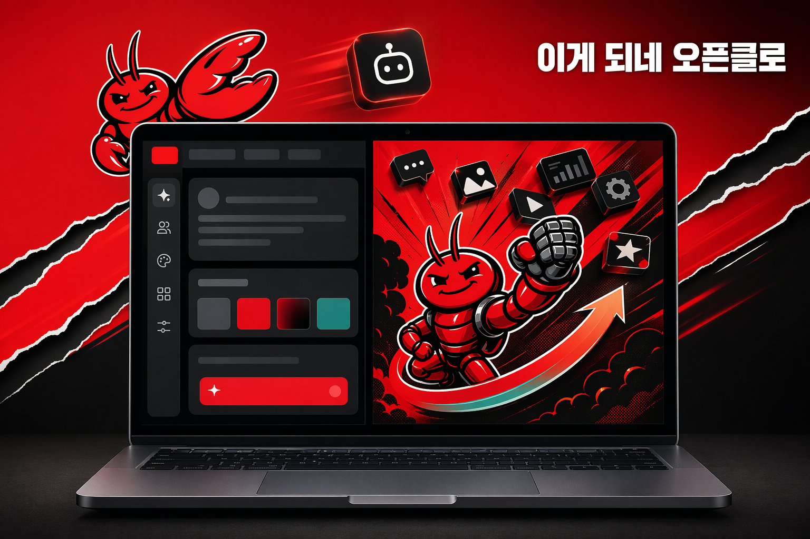

# openclaw-codex-image-gen

Reference book link: <https://www.yes24.com/product/goods/185166276>

OpenClaw plugin for generating images via `codex responses` and the `image_generation` tool under the current Codex login session.



Inspired by [hermes-gpt-image-gen](https://github.com/Jinbro98/hermes-gpt-image-gen) and the reference skill [codex-image-generation-skill](https://github.com/Gyu-bot/codex-image-generation-skill), then adapted for the OpenClaw plugin lifecycle and tool interface.

## Examples

| Prompt | Result |
|---|---|
| A cute robot cat sitting on a cloud, digital art, vibrant colors |  |
| Korean e-commerce poster |  |
| Korean tech-book promotional hero banner |  |

## English first

### What this plugin does

It registers a tool named `codex_image_generate` inside OpenClaw.
When the tool is called, the plugin:

1. checks candidate Codex CLI binaries,
2. prefers one machine-specific user-installed Codex path first,
3. sends a raw Responses API payload to `codex responses`,
4. requests the `image_generation` tool explicitly,
5. extracts a base64 image when Codex emits the expected streamed JSONL event shape,
6. writes the decoded image to disk,
7. returns the saved file path back to OpenClaw.

In short, this plugin uses Codex's `image_generation` tool directly, instead of falling back to a code-generated image workaround.

### Why this changed

The original version of this repo assumed a `$imagegen` flow through `codex exec`.
That turned out to be unreliable in this environment for two separate reasons:

- an older Codex binary on `PATH` was being selected first,
- the practical Codex image-generation path that worked consistently was `codex responses` with the `image_generation` tool.

So the plugin was updated to match the working path.

## How it works

```text
User prompt -> JSON payload -> codex responses -> JSONL stream -> base64 decode -> PNG file
```

### 1. Binary selection

The plugin prefers this Codex binary first:

```bash
/Users/conanssam-m4/.npm-global/bin/codex
```

This is a machine-specific preference baked into the current implementation, not a universal install path for every machine.

That matters because this machine also had an older binary earlier on `PATH`:

```bash
/usr/local/bin/codex
```

The newer binary worked with `codex responses` in this environment, the older one did not.

### 2. MCP compatibility override

The plugin launches Codex with:

```bash
-c mcp_servers={}
```

This intentionally disables inherited MCP server config for the Codex subprocess.
On this machine, some MCP definitions caused compatibility failures when passed into Codex CLI during image generation.

### 3. Responses API payload

Instead of prompting Codex conversationally, the plugin sends a structured payload to:

```bash
codex responses
```

The payload explicitly requests:

- model: `gpt-5.4`
- tool: `image_generation`
- size: derived from `aspect_ratio`
- background: `auto`, `opaque`, or `transparent`
- action: `generate`

### 4. Streaming event extraction

Codex returns JSONL event output.
The plugin scans for:

- `type = response.output_item.done`
- `item.type = image_generation_call`

When that event shape is present, it reads the `result` field, decodes the base64 bytes, and writes the PNG file.

### 5. 429 round-robin fallback

If ohmyclaw's Codex OAuth pool is available, the plugin can retry on the next OAuth account when one account hits a 429 / `usage_limit_reached` error.

Expected setup:

- `CODEX_OAUTH_ENABLED=true`
- multiple Codex homes logged in, for example:
  - `~/.codex`
  - `~/.codex-acct2`
  - `~/.codex-acct3`
- the corresponding Codex pool accounts enabled in:
  - `~/.openclaw/repos/ohmyclaw/skills/ohmyclaw/routing.json`

Behavior:

1. pick the next Codex OAuth account with `pool.sh next gpt-5.4`
2. call `codex responses` with that `CODEX_HOME`
3. if a 429 / `usage_limit_reached` error appears, mark that account in cooldown
4. retry with the next eligible OAuth account

This makes image generation much more resilient when one ChatGPT/Codex OAuth account is temporarily exhausted.

### 6. OpenClaw return value

The plugin returns:

```json
{
  "image_path": "/absolute/path/to/file.png",
  "file_name": "file.png",
  "output_dir": "/absolute/path/to/output-dir",
  "stdout_log": "/absolute/path/to/codex.responses.jsonl",
  "stderr_log": "/absolute/path/to/codex.stderr.log",
  "assistant_hint": "Image generated at: ..."
}
```

## Features

- **Tool**: `codex_image_generate`
- **Direct Codex `image_generation` usage** via `codex responses`
- **Aspect ratio mapping**:
  - `square` → `1024x1024`
  - `landscape` → `1536x1024`
  - `portrait` → `1024x1536`
- **Background options**: `auto`, `transparent`, `opaque`
- **Korean + English trigger routing** through `pre_llm_call`
- **Codex availability caching** for 5 minutes
- **Temp directory cleanup** for stale output folders
- **Saved event logs** for debugging extraction failures
- **429 round-robin fallback** through the ohmyclaw Codex OAuth pool when multiple accounts are enabled

## Prerequisites

1. [OpenAI Codex CLI](https://github.com/openai/codex) installed
2. A Codex version that supports:

```bash
codex responses
```

3. Logged in Codex session, ideally verified with:

```bash
codex login status
```

Recommended result:

```bash
Logged in using ChatGPT
```

## Installation

```bash
git clone https://github.com/jkf87/openclaw-codex-image-gen.git
cp -r openclaw-codex-image-gen ~/.openclaw/workspace-<your-bot>/local-plugins/codex-image-gen
openclaw gateway restart
```

Or download directly:

```bash
mkdir -p ~/.openclaw/workspace-<your-bot>/local-plugins/codex-image-gen
cd ~/.openclaw/workspace-<your-bot>/local-plugins/codex-image-gen
curl -sLO https://raw.githubusercontent.com/jkf87/openclaw-codex-image-gen/main/index.ts
curl -sLO https://raw.githubusercontent.com/jkf87/openclaw-codex-image-gen/main/openclaw.plugin.json
curl -sLO https://raw.githubusercontent.com/jkf87/openclaw-codex-image-gen/main/package.json
```

## Usage in OpenClaw

Once installed, the plugin registers `codex_image_generate` automatically.

### Natural language

Just ask naturally. The `pre_llm_call` hook detects image requests in Korean and English.

```text
"고양이 일러스트 그려줘" -> auto-detect -> codex_image_generate -> PNG saved
```

### Direct tool call

```json
{
  "tool": "codex_image_generate",
  "input": {
    "prompt": "A futuristic city skyline at sunset, cyberpunk style",
    "aspect_ratio": "landscape",
    "background": "opaque"
  }
}
```

### Tool parameters

| Parameter | Required | Description |
|---|---|---|
| `prompt` | Yes | Creative prompt for the image |
| `aspect_ratio` | No | `landscape`, `square`, or `portrait` |
| `file_name` | No | Output file name, sanitized and saved as `.png` |
| `output_dir` | No | Directory to save the image |
| `background` | No | `auto`, `transparent`, or `opaque` |
| `timeout_seconds` | No | Override subprocess timeout |

Implementation note: `model: "gpt-5.4"` and `quality: "high"` are currently hardcoded in `index.ts` and are not user-configurable yet.

## Configuration

| Key | Type | Default | Description |
|---|---|---|---|
| `outputDir` | string | `""` | Default output directory. Uses a temp directory when empty. |
| `timeoutSeconds` | number | `120` | Max wait time for the Codex subprocess. |
| `tempDirMaxAgeHours` | number | `24` | Age threshold for deleting stale temp directories. |
| `cleanupIntervalMinutes` | number | `60` | How often stale temp cleanup is attempted. |

## Troubleshooting

### `codex responses` is missing

You are probably calling an older Codex binary.
Check both:

```bash
which -a codex
/Users/conanssam-m4/.npm-global/bin/codex --version
/usr/local/bin/codex --version
```

If needed, update the user-installed Codex and prefer that path.

### Codex is logged in, but generation still fails

Run:

```bash
codex login status
```

If the session is not valid, re-login.

### MCP-related failures appear during generation

This plugin already launches Codex with:

```bash
-c mcp_servers={}
```

That is intentional, to keep the image-generation subprocess isolated from incompatible inherited MCP config.

### No image was extracted

Inspect the saved event log from `stdout_log`.
The expected successful event contains:

- `response.output_item.done`
- `item.type = image_generation_call`

## Korean trigger routing

The `pre_llm_call` hook auto-detects image generation requests.
It is hint-based routing, not guaranteed intent classification.

| Category | Keywords |
|---|---|
| Engine | codex, 코덱스, gpt, openai |
| Nouns | 이미지, 그림, 사진, 아이콘, 일러스트, 배경, 로고, image, picture, icon, illustration |
| Verbs | 생성, 만들, 그려, 그리, 제작, generate, create, draw, make |

Triggers when: `(engine + noun)` OR `(noun + verb)`.

## 한국어 안내

### 이 플러그인이 하는 일

이 플러그인은 OpenClaw 안에 `codex_image_generate` 도구를 등록합니다.
호출되면 내부적으로 다음 순서로 동작합니다.

1. 쓸 수 있는 Codex CLI를 찾음
2. 가능하면 최신 사용자 설치 Codex를 우선 사용함
3. `codex responses`로 raw Responses payload를 보냄
4. `image_generation` 툴을 명시적으로 요청함
5. JSONL 스트림에서 이미지 결과를 추출함
6. base64 이미지를 실제 PNG 파일로 저장함
7. 저장 경로를 OpenClaw에 반환함

즉, Codex가 코드로 가짜 이미지를 그리는 우회가 아니라, **Codex의 실제 `image_generation` 경로**를 사용합니다.

### 왜 수정했는가

원래 README와 구현은 `$imagegen` + `codex exec` 쪽에 기대고 있었는데, 이 환경에서는 그 경로가 안정적으로 동작하지 않았습니다.

이유는 두 가지였습니다.

- PATH 앞쪽에 예전 Codex 바이너리가 잡히고 있었음
- 실제로 안정적으로 성공한 방식은 `codex responses` + `image_generation` 호출이었음

그래서 구현과 문서를 둘 다 그 기준으로 수정했습니다.

### 429가 뜰 때 Codex OAuth 라운드로빈

이 플러그인은 ohmyclaw의 Codex OAuth pool이 켜져 있으면, 한 계정에서 429가 떠도 바로 죽지 않고 다음 계정으로 넘길 수 있습니다.

전제 조건은 다음과 같습니다.

- `CODEX_OAUTH_ENABLED=true`
- 여러 Codex 홈이 로그인되어 있어야 함
  - `~/.codex`
  - `~/.codex-acct2`
  - `~/.codex-acct3`
- `~/.openclaw/repos/ohmyclaw/skills/ohmyclaw/routing.json` 에서 codex pool 계정이 `enabled: true` 여야 함

동작 순서는 이렇습니다.

1. `pool.sh next gpt-5.4` 로 다음 계정을 고름
2. 그 계정의 `CODEX_HOME` 으로 `codex responses` 호출
3. 429 또는 `usage_limit_reached` 가 뜨면 해당 계정을 cooldown 처리
4. 다음 계정으로 자동 재시도

즉, Plus/Pro 계정이 여러 개면 이미지 생성 한도를 한 계정에만 묶지 않고 분산할 수 있습니다.

### 한국어 사용도 지원함

플러그인에는 `pre_llm_call` 훅이 들어 있어서, 한국어와 영어의 이미지 생성 요청을 둘 다 감지하도록 해두었습니다.
다만 이건 힌트 기반 라우팅이지, 완전한 의도 분류 보장은 아닙니다.
예를 들면 다음 같은 표현을 라우팅 대상으로 볼 수 있습니다.

- "코덱스로 이미지 만들어줘"
- "이미지 생성해줘"
- "draw an icon"
- "generate a picture"

## License

MIT
